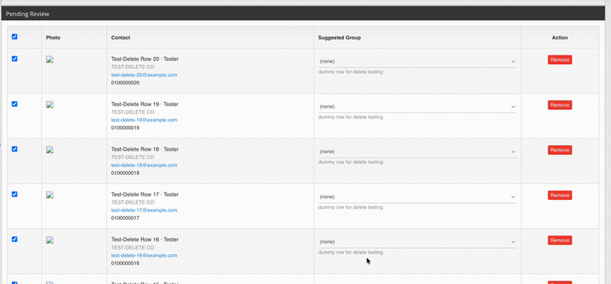

# SmoothDelete

**Accessible AJAX row deletion with animated collapse — a reusable frontend
component, not just a demo.**

Deleting one table row should feel immediate and polished, even in older
business systems. SmoothDelete gives you a drop-in pattern for deleting
records asynchronously, animating the row out of the interface, and
avoiding a disruptive full-page reload. Copy `assets/smooth-delete.js` and
`assets/smooth-delete.css` straight into your own project — new build or
legacy — and adapt the small backend endpoint to your framework.


<!-- Record a short screen capture of the animation and replace this GIF. -->

## Why this exists (the story)

Most CRUD scaffolding deletes a row by navigating to a URL and reloading
the whole page. That:

- interrupts the user's workflow (scroll position, filters, pagination all reset)
- makes an app feel outdated even when the backend is fine
- invites accidental double-submits
- leaves the user unsure whether the action actually worked

SmoothDelete keeps the user in context: the row fades, collapses its
height, and disappears — with a clear, accessible status message and no
navigation.

## Impact

**User experience.** The interface stays in place. No reset scroll
position, no re-fetched page, no flash of a full reload — just the one
row leaving, exactly where the user was looking.

**Engineering cost.** Instead of every project reinventing this pattern
(and usually getting the CSS-timing details wrong on the first try), teams
can copy one small, tested component and wire it to whatever backend they
have — Laravel, Flask, plain PHP, a 15-year-old ASP.NET Web Forms app,
anything that can return JSON.

I'm not going to claim a specific dollar figure saved — that depends on
your team and your app. The honest claim is: less duplicated
implementation work, one consistent interaction across old and new
stacks, and fewer accidental duplicate-delete requests from double-clicks.

## How to reuse this as a library

This is meant to be **copied into your own codebase**, not installed as a
package with a version resolver. That's deliberate — it keeps it usable
in legacy stacks with no package manager at all.

1. Copy `assets/smooth-delete.css` and `assets/smooth-delete.js` (or
   `examples/jquery-legacy/smooth-delete.jquery.js` if your project
   already depends on jQuery) into your project.
2. Give each deletable row `data-delete-row`, and its delete button
   `data-delete-url="/your/endpoint"` (see **Markup contract** below).
3. Add `<div id="sd-status" role="status" aria-live="polite" hidden></div>`
   somewhere on the page for accessible success/error messages.
4. Implement one endpoint on your backend that matches the **response
   contract** below. See `examples/` for a complete, working reference in
   each stack.
5. Adjust the CSS timings/colors, or the JS's selectors, to match your
   own design system — it's a starting point to redevelop from, not a
   black box.

## Markup contract

```html
<table>
  <tbody>
    <tr data-delete-row>
      <td>42</td>
      <td>Example record</td>
      <td>
        <button type="button" data-delete-url="/records/42" data-delete-mode="safe">
          Delete
        </button>
      </td>
    </tr>
  </tbody>
</table>
<p data-empty-state hidden>No records left.</p>
<div id="sd-status" role="status" aria-live="polite" hidden></div>
```

## Backend response contract

| Situation | HTTP status | Body |
|---|---|---|
| Deleted | 200 | `{"success": true}` |
| Invalid id | 400 | `{"success": false, "message": "..."}` |
| Not authorized | 403 | `{"success": false, "message": "..."}` |
| Not found | 404 | `{"success": false, "message": "..."}` |
| Server error | 500 | `{"success": false, "message": "..."}` |

Hiding a row in the browser is **not** proof the database row was
deleted. The backend must validate, authorize, and check CSRF on every
request — the frontend only reacts to what the backend actually confirms.

## Safe mode vs. optimistic mode

- **Safe mode (default, recommended):** the row animates out only after
  the server confirms `{success: true}`. On failure, the button
  re-enables and an error is shown. UI and database never disagree.
- **Optimistic mode:** the row animates out as soon as the request
  settles, even on failure or a network error (`data-delete-mode="optimistic"`,
  mirroring jQuery's `.always()`). Use this only where instant feedback
  matters more than occasional disagreement between the screen and the
  database, and SmoothDelete always shows a visible warning when the
  server did not actually confirm the deletion.

## Examples

| Stack | Status | Path |
|---|---|---|
| Shared JS/CSS (no framework) | ✅ working | `assets/` |
| jQuery (legacy projects) | ✅ working | `examples/jquery-legacy/` |
| Plain PHP + PDO/SQLite | ✅ working | `examples/plain-php/` |
| Laravel | 🚧 planned (v0.2.0) | `examples/laravel/` |
| Python/Flask | 🚧 planned (v0.2.0) | `examples/python-flask/` |
| ASP.NET Core (C#) | 🚧 planned (v0.3.0) | `examples/aspnet-csharp/` |
| ASP.NET (VB.NET) | 🚧 planned (v0.3.0) | `examples/aspnet-vb/` |

### Run the plain PHP example

```bash
cd examples/plain-php
php -S localhost:8000
```

Then open `http://localhost:8000/index.php`. It creates a local SQLite
file on first run — no configuration needed.

### Open the jQuery example

`examples/jquery-legacy/index.html` fakes the server response client-side
so you can see the animation with zero setup. Open it directly in a
browser.

## Accessibility

- Respects `prefers-reduced-motion` (animation collapses to ~1ms).
- Status messages use `role="status" aria-live="polite"` so screen readers
  announce success/failure without moving focus.
- The delete button is a real `<button>`, not a link styled to look like one.
- The delete button is disabled for the duration of the request so a
  double-click (or a screen-reader user's double-activation) cannot fire
  two delete requests.

## Security notes

- Every backend example uses parameterized queries / an ORM — never
  string-concatenated SQL.
- Every backend example checks a CSRF token on the delete request.
- Every backend example is expected to check that the current user is
  authorized to delete that specific record (the plain-PHP example marks
  where you'd add this check for your own auth system).
- Return `404` for a record that doesn't exist and `403` for one the user
  isn't allowed to delete — don't leak which case it is by using the same
  status for both if your authorization model requires hiding that detail.

## Browser support

Uses `fetch`, `requestAnimationFrame`, and CSS transitions — supported in
all current evergreen browsers. No polyfills included; add your own if
you need to support very old browsers.

## Contributing

Contributions are welcome — see [CONTRIBUTING.md](CONTRIBUTING.md).
Adding another backend example (a different framework, a different
language) is one of the most useful things you can contribute.

## Roadmap

- v0.1.0 — shared JS/CSS, jQuery legacy example, plain PHP example, docs (this release)
- v0.2.0 — Laravel and Python/Flask examples
- v0.3.0 — ASP.NET C# and ASP.NET VB.NET examples
- v1.0.0 — automated tests across all examples, accessibility review, CI

## License

[MIT](LICENSE) — use it, modify it, ship it in commercial software, just
keep the copyright notice.
