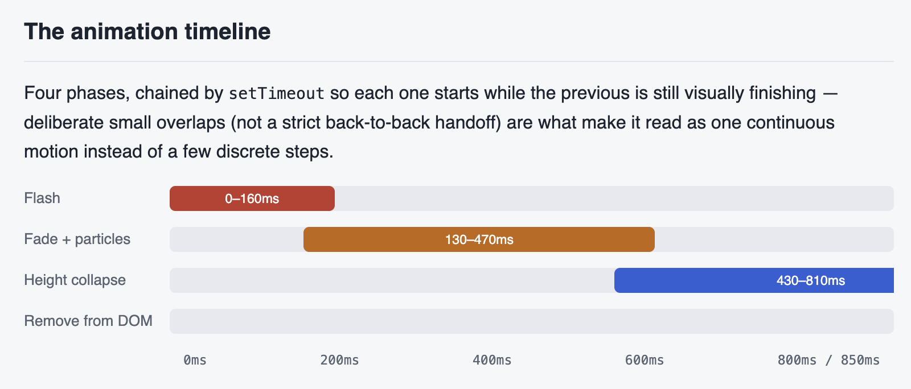
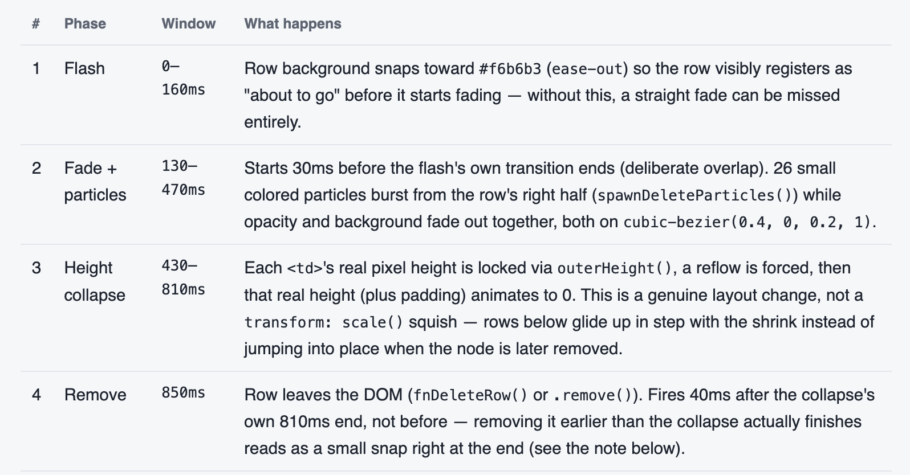
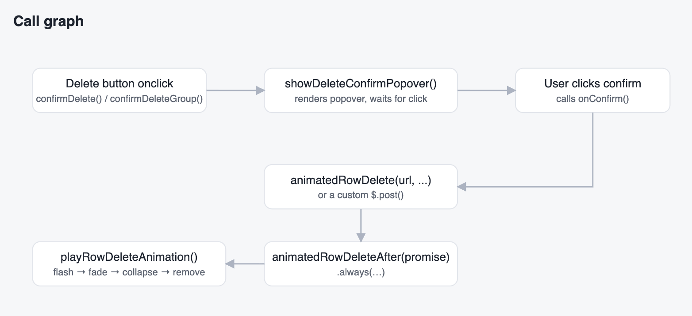

# Advanced pattern: inline popover confirm + particle-burst timeline

This is an optional, more elaborate variant of the core SmoothDelete pattern,
documented here as a case study rather than shipped as code — it trades some
of the base library's simplicity for a richer feel, and is worth adopting
only if that tradeoff makes sense for your app.

It changes two things from the core pattern:

1. **Confirmation** happens in a small popover anchored to the Delete button
   itself, instead of `window.confirm()` or a centered modal — no screen
   takeover for what's usually a one-row decision.
2. **The animation** adds a color flash and a small particle burst before the
   fade/collapse, so the row's departure reads clearly even to a user who
   isn't looking directly at it when it happens.

Nothing about *what* gets deleted, or how the delete request itself works,
changes — this sits in front of the same request described in the
[architecture doc](architecture.md), purely as a confirm-and-feedback layer.

## The timeline

Four phases, deliberately overlapping rather than strictly sequential — each
phase starts slightly before the previous one visually finishes, which is
what makes it read as one continuous motion instead of a few discrete steps.





### The timing invariant to preserve

**The final removal delay must always be greater than collapse-start +
collapse-duration.** This is the one lesson from this pattern worth
remembering above all the specific numbers: a later smoothing pass extended
the collapse duration without moving the removal timer to match, so the row
was pulled from the DOM roughly 10ms before its height had visibly reached
zero — a small but visible snap right at the end. If you ever change either
duration, re-check the removal delay against it:

```
collapse start (430ms) + collapse duration (380ms) = 810ms < removal (850ms)
```

## The reusable function shape

The pattern only needs three functions, each with a single job, called in
sequence:



```js
// 1. Confirmation — replaces window.confirm() / a modal
showDeleteConfirmPopover(button, message, onConfirm, opts);
// opts.confirmLabel / opts.confirmClass let the same popover be reused
// for non-destructive confirmations too, not just deletes.

// 2. The visual sequence itself, independent of how the request was made
playRowDeleteAnimation($row, tableInstanceOrNull, onRemoved);

// 3. The common case — fire the request, animate regardless of outcome
animatedRowDelete(deleteUrl, $row, tableInstanceOrNull);
// built on a more general animatedRowDeleteAfter(promise, $row, table)
// for callers whose delete is a custom request with its own
// success/failure branching (e.g. a delete that requires re-authentication).
```

Keeping these three responsibilities separate is what lets a page with an
unusual delete flow — one that needs a password, or has to POST instead of
GET — reuse the same popover and the same animation without reimplementing
either. Only the request itself changes; the confirm UI and the departure
animation stay identical everywhere.

## When this variant is (and isn't) worth it

This is more visual polish than the core SmoothDelete pattern, at the cost
of more moving parts: a popover-positioning library, a small particle
system, and finer-grained animation timing to maintain. It's a reasonable
choice for an internal admin tool used daily by the same small group of
people, where a bit of extra visual delight compounds over thousands of
uses. It's probably more than a public-facing app or an occasional-use
admin panel needs — the core pattern (fade → collapse → remove, confirmed
via a plain dialog) covers the same functional ground with far less code
to keep correct.
